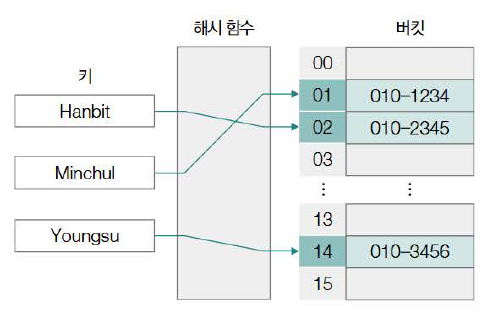
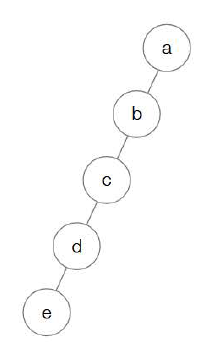
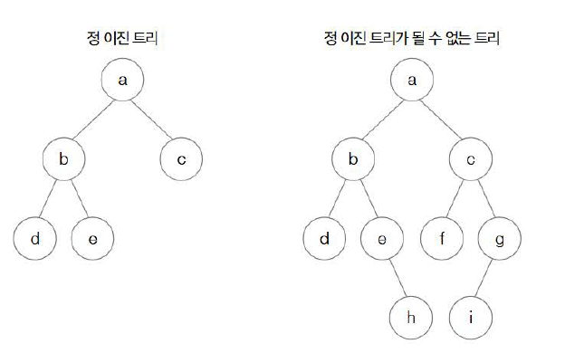
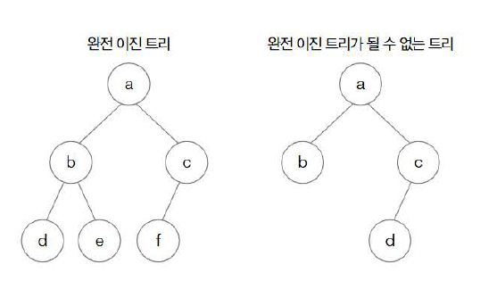
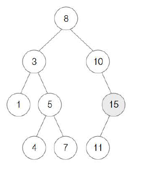
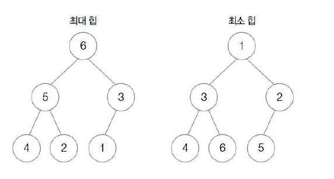

# 1. 자료구조의 큰 그림

## 자료구조와 알고리즘

- 자료구조는 데이터를 효율적으로 저장하고 관리하는 방법이다.
- 메모리의 스택 영역이나 운영체제의 스케줄링 큐도 자료구조의 일종이다.
- 알고리즘은 어떤 목적을 이루기 위해 필요한 일련의 효율적인 연산 절차이다.

## 시간 복잡도와 공간 복잡도

프로그램 개발 과정에서 개발자는 소스 코드를 통해 다양한 데이터를 다루고(자료구조), 특정 목적을 이루기 위한 연산(알고리즘)을 구현하게 된다.

이때 자료구조와 알고리즘을 신중하게 고려하여 작성된 코드는 그렇지 않은 코드에 비해 훨씬 더 높은 품질과 성능을 보일 가능성이 크다.

실제로 같은 목적을 가진 프로그램이라도 자료구조와 알고리즘의 고려 여부에 따라 극명한 성능 차이를 나타낼 수 있다.

그렇다면, 이러한 성능 차이를 객관적으로 판단할 수 있는 방법은 무엇일까?

바로 시간 복잡도와 공간 복잡도를 통해 알 수 있다. 이 두 가지는 소스 코드나 프로그램이 얼마나 효율적인지를 판단하는 중요한 척도이다.

### 시간 복잡도 (Time Complexity)

- **정의**
  - 시간 복잡도는 입력 데이터의 크기(N)가 변함에 따라 프로그램의 실행 시간(정확히는 연산 횟수)이 어떻게 달라지는지를 나타내는 관계이다.
- **입력 크기와의 관계**
  - 프로그램의 실행 시간과 입력의 크기는 밀접한 관계가 있다. 예를 들어, N개의 데이터를 처리하는 프로그램이 있을 때, N이 1일 때보다 100일 때, 10000일 때 평균적으로 더 오랜 실행 시간이 소요될 것이다.
- **연산 횟수**
  - 시간 복잡도는 입력의 크기에 따른 연산 횟수의 변화로 이해할 수도 있다.
  - 예시 1: `1+1` 연산은 입력 크기와 관계없이 항상 1번의 연산이 필요하다.
  - 예시 2: `for _ in range(n): 1+1` 코드는 입력 n에 비례하여 n번의 연산이 필요하다.
  - 예시 3: `for _ in range(n): for _ in range(n): 1+1` 코드는 입력 n의 제곱에 비례하여 n²번의 연산이 필요하다.
- **반복문의 영향**
  - 예시에서 보듯, 코드 내의 반복문 구조(특히 중첩 반복문)는 시간 복잡도에 가장 큰 영향을 미치는 요소 중 하나이다.

### 최악의 경우와 빅 오 표기법

- **실행 시간의 가변성**
  - 현실의 프로그램은 입력 크기가 같더라도 데이터의 상태(최선, 평균, 최악)에 따라 연산 횟수와 실행 시간이 달라질 수 있다.
- **점근적 분석의 필요성**
  - 이런 가변성 속에서 프로그램의 성능을 일관되게 표현하기 위해, 입력 크기 n이 매우 커질 때의 성능 경향성을 분석하는 점근적 분석 방법을 사용한다.
- **빅 오 표기법 (Big O Notation)**
  - 시간 복잡도를 표현하는 가장 대중적인 방법으로, 함수의 점근적 상한을 나타낸다.
  - 의미: "입력 크기 n이 특정 값 이상일 때, 프로그램의 실행 시간(연산 횟수)은 아무리 커져도 cg(n)을 넘지 않는다"는 의미를 내포한다. 수학적으로는 다음과 같이 표현할 수 있다:
    - c > 0, n₀ > 0, n ≥ n₀: f(n) ≤ c·g(n)
    - 이는 f(n) = O(g(n))으로 표기한다.
  - 표기 규칙: 빅 오 표기법에서는 연산 횟수에 가장 큰 영향을 미치는 최고차항만을 남기고, 계수와 상수항은 무시하여 복잡도를 간결하게 표현한다.
    - 예시: n² + 3n + 2 = O(n²)
    - 예시: 2n³ + 5n² + 3n + 1 = O(n³)

### 주요 시간 복잡도
시간 복잡도는 아래로 갈수록 비효율적이다:

| 복잡도 | 설명 | 예시 |
|--------|------|------|
| O(1) | 상수 시간 | 배열의 인덱스 접근 |
| O(log n) | 로그 시간 | 이진 탐색 |
| O(n) | 선형 시간 | 순차 탐색 |
| O(n log n) | 선형 로그 시간 | 효율적인 정렬 알고리즘 |
| O(n²) | 이차 시간 | 단순 정렬 알고리즘 |
| O(2ⁿ) | 지수 시간 | 피보나치 수열 재귀 |
| O(n!) | 팩토리얼 시간 | 순열 알고리즘 |

### 정렬 알고리즘 시간 복잡도
| 알고리즘 | 시간 복잡도 | 특징 |
|----------|------------|------|
| 삽입 정렬 | O(n²) | 작은 데이터에 효율적 |
| 선택 정렬 | O(n²) | 구현이 간단 |
| 버블 정렬 | O(n²) | 구현이 간단하나 비효율적 |
| 병합 정렬 | O(n log n) | 안정적인 성능 |
| 퀵 정렬 | O(n log n) | 평균적으로 가장 빠름 |
| 힙 정렬 | O(n log n) | 추가 메모리 필요 없음 |

### 공간 복잡도 (Space Complexity)

- **정의**
  - 공간 복잡도는 시간 복잡도와 유사하게, 입력 데이터의 크기(N)가 변함에 따라 프로그램 실행 시 필요한 메모리 자원의 양이 어떻게 달라지는지를 나타내는 척도이다.
- **표현**
  - 공간 복잡도 역시 빅 오 표기법으로 표현할 수 있다.
- **중요도**
  - 알고리즘 성능을 판단할 때 시간 복잡도와 공간 복잡도 모두 중요하지만, 일반적으로 시간 복잡도가 주요 평가 척도로 더 자주 사용되는 경향이 있다.

<br/><br/>

# 2. 배열과 연결 리스트

## 배열 (Array)

### 정의

- 일정한 메모리 공간을 차지하는 여러 요소들이 순차적으로 나열된 자료구조
- 각 요소는 0부터 시작하는 고유한 인덱스(Index)를 가짐

### 주요 특징

#### 1. 인덱스 기반 접근

- RAM과 유사하게 인덱스를 통한 요소 접근 시간이 일정
- 시간 복잡도: O(1)
- 특정 인덱스의 요소 읽기/수정이 매우 빠름

#### 2. 순차 검색 (Linear Search)

- 정렬되지 않은 배열에서 특정 값 탐색
- 시간 복잡도: O(N)
- 모든 요소를 순차적으로 확인해야 함

#### 3. 삽입 및 삭제 연산

- 특정 위치에 요소 추가/삭제 시 이후 요소들의 이동 필요
- 시간 복잡도: O(N)
- 중간 위치의 삽입/삭제가 비효율적

#### 4. 다차원 배열

- 1차원 배열을 기반으로 확장 가능
- 2차원: 행과 열 인덱스 사용
- 3차원: 세 개의 인덱스 사용
- N차원으로 확장 가능
- 메모리상에서는 선형적으로 저장

### 배열의 종류

#### 1. 정적 배열 (Static Array)

- 프로그램 실행 전 크기가 고정
- 실행 중 크기 변경 불가
- 예: 5개 원소 선언 시 6개 이상 할당 불가

#### 2. 동적 배열 (Dynamic Array)

- 프로그램 실행 중 크기 변경 가능
- 요소 개수가 동적으로 변할 수 있음
- 일부 언어에서는 '벡터(Vector)'로 구현

### 활용

- 가장 기본적이면서 활용도가 높은 자료구조
- 데이터의 순차적 관리에 적합
- 다른 복잡한 자료구조나 알고리즘의 기반으로 활용

## 연결 리스트 (Linked List)

### 기본 개념

- 노드(Node)들의 모음으로 구성된 자료구조
- 각 노드는 다음 두 가지 정보를 포함:
  1. 저장하고자 하는 데이터
  2. 다음 노드의 위치(메모리 주소)

### 주요 특징

#### 1. 노드 연결 방식

- 각 노드는 다음 노드의 위치 정보를 통해 연결
- 헤드(Head): 첫 번째 노드
- 테일(Tail): 마지막 노드
- 마지막 노드는 NULL로 표시

#### 2. 비연속적 저장

- 메모리 내 순차적 저장 불필요
- 연속적 데이터를 비연속적으로 저장 가능

### 연산 복잡도

#### 1. 요소 접근 (Access)

- 시간 복잡도: O(N)
- 헤드부터 순차적 접근 필요
- 배열의 O(1) 접근과 대비

#### 2. 삽입 및 삭제 (Insertion & Deletion)

- 시간 복잡도: O(1) (위치가 주어진 경우)
- 노드 연결만 변경하면 됨
- 배열의 O(N) 재정렬과 대비

### 연결 리스트의 종류

#### 1. 단일 연결 리스트 (Singly Linked List)

- 각 노드가 다음 노드만 가리킴
- 단방향 탐색만 가능
- 이전 노드 접근 불가

#### 2. 이중 연결 리스트 (Doubly Linked List)

- 각 노드가 이전/다음 노드 모두 가리킴
- 양방향 탐색 가능
- 추가 메모리 공간 필요

#### 3. 원형 연결 리스트 (Circular Linked List)

- 테일이 헤드를 가리키는 구조
- 환형 연결 리스트라고도 함
- 순환적 데이터 처리에 유용
- 이중 연결 리스트로도 구현 가능


# 3. 스택과 큐

## 스택 (Stack)

### 정의

- 한쪽 끝에서만 데이터의 삽입과 삭제가 가능한 자료구조
- 후입선출(LIFO, Last In First Out) 구조
- 기본 연산: Push(삽입), Pop(삭제)

### 특징

#### 기본 연산

- Push: 데이터를 스택의 최상단에 추가
- Pop: 스택의 최상단 데이터를 제거하고 반환
- Peek/Top: 최상단 데이터를 제거하지 않고 확인

#### 시간 복잡도

- 삽입(Push): O(1)
- 삭제(Pop): O(1)
- 탐색(Search): O(n)

### 활용

#### 함수 호출 관리

- 함수 호출 시 매개변수, 지역변수, 반환 주소 저장
- 재귀 함수의 호출 스택 관리
- 함수 실행 완료 시 LIFO 순서로 메모리 해제

#### 웹 브라우저 뒤로가기

- 방문한 URL을 스택에 저장
- 뒤로가기 시 최근 URL부터 Pop
- 예시:
  ```
  Push(google.com) → [google.com]
  Push(naver.com) → [google.com, naver.com]
  Push(daum.net) → [google.com, naver.com, daum.net]
  Pop() → [google.com, naver.com] (daum.net으로 이동)
  ```

#### 미로 탐색

- 현재 위치를 스택에 저장
- 막다른 길 발견 시 Pop으로 이전 위치로 복귀
- 예시:
  ```
  Push(1) → [1]
  Push(6) → [1, 6]
  Push(7) → [1, 6, 7]
  Push(8) → [1, 6, 7, 8]
  Pop() → [1, 6, 7] (8에서 7로 복귀)
  ```

## 구현

### 배열 기반 구현
- 고정된 크기의 메모리 할당
- 빠른 접근 속도
- 스택 오버플로우 가능성

### 연결 리스트 기반 구현
- 동적 메모리 할당
- 메모리 효율적
- 약간의 오버헤드 발생

## 큐 (Queue)

### 개념

- 한쪽 끝(rear)에서 삽입, 다른 한쪽 끝(front)에서 삭제하는 선형 자료구조
- FIFO(First In First Out) 원칙을 따르는 자료구조
- 먼저 들어온 데이터가 먼저 나가는 구조

### 기본 연산

- 삽입(Enqueue): O(1)
- 삭제(Dequeue): O(1)
- 탐색(Search): O(n)

### 활용

#### 프린터 작업 대기열

- 인쇄 요청을 순서대로 처리
- 먼저 요청된 문서부터 인쇄
- 예시:
  ```
  Enqueue(문서1) → [문서1]
  Enqueue(문서2) → [문서1, 문서2]
  Enqueue(문서3) → [문서1, 문서2, 문서3]
  Dequeue() → [문서2, 문서3] (문서1 인쇄)
  ```

#### CPU 작업 스케줄링

- 프로세스 실행 순서 관리
- 라운드 로빈 스케줄링에 활용
- 예시:
  ```
  Enqueue(프로세스A) → [프로세스A]
  Enqueue(프로세스B) → [프로세스A, 프로세스B]
  Dequeue() → [프로세스B] (프로세스A 실행)
  ```

### 변형

#### 원형 큐 (Circular Queue)

- 배열의 처음과 끝을 연결한 형태
- 메모리 재사용이 가능한 구조
- 고정된 크기의 메모리로 구현

#### 덱 (Deque)

- 양쪽 끝에서 삽입/삭제 가능
- 스택과 큐의 기능을 모두 가짐
- 양방향 대기열 구현에 활용

#### 우선순위 큐 (Priority Queue)

- 우선순위가 높은 데이터가 먼저 처리
- 힙(Heap) 자료구조로 구현
- 작업 스케줄링, 이벤트 처리에 활용

## 구현

### 배열 기반 구현

- 고정된 크기의 메모리 사용
- 빠른 접근 속도
- 메모리 낭비 가능성

### 연결 리스트 기반 구현

- 동적 메모리 할당
- 메모리 효율적
- 약간의 오버헤드 발생


# 4. 해시 테이블 (Hash Table)

## 개요

해시 테이블(Hash Table)은 키(Key)와 값(Value)의 쌍으로 이루어진 데이터를 효율적으로 저장하고 검색할 수 있는 자료구조입니다.

## 핵심 원리

1. **키(Key)**: 데이터를 고유하게 식별하는 역할
2. **해시 함수(Hash Function)**: 키를 해시 값(Hash Value)으로 변환
3. **버킷(Bucket)**: 키-값 쌍을 저장하는 공간
4. **인덱스**: 해시 값을 통해 버킷 배열의 위치를 결정

## 동작 방식

- 키를 해시 함수에 입력 → 해시 값 생성
- 해시 값을 인덱스로 사용하여 버킷 접근
- 해당 버킷에 키-값 쌍 저장 또는 검색



## 활용 예시

- **운영체제**: 페이지 캐시, 아이노드 캐시
- **데이터베이스**: 인덱싱
- **네트워크**: 라우팅 테이블
- **컴파일러**: 심볼 테이블

## 성능 지표

### 로드 팩터 (Load Factor)

- 정의: 저장된 데이터 수 / 전체 버킷 수
- 영향: 높을수록 해시 충돌 증가, 성능 저하

## 해시 함수 (Hash Function)

해시 함수는 임의의 길이를 가진 입력 데이터(키)를 고정된 길이의 해시 값(해시 코드)으로 변환하는 함수입니다.

### 해시 함수의 특징

1. **단방향성**
   - 입력 데이터로부터 해시 값 계산은 쉽지만
   - 해시 값으로부터 원본 데이터 추론은 매우 어려움

2. **해시 알고리즘**
   - 해시 함수를 구현하는 구체적인 연산 방식
   - 대표적인 알고리즘: SHA-256, SHA-512
   - (참고: MD5, SHA-1은 보안 취약점으로 사용 권장되지 않음)

3. **입력 민감성 (눈사태 효과)**
   - 입력 데이터의 미세한 변화도 해시 결과값을 크게 변경
   - 예측 불가능성 향상

### 해시 함수의 활용

1. **데이터 무결성 검증**
   - 원본 데이터와 수신/저장 데이터의 해시 값 비교
   - 예: 파일 다운로드 시 체크섬

2. **비밀번호 저장**
   - 원본 비밀번호 대신 해시 값 저장
   - 로그인 시 입력값의 해시와 저장된 해시 비교
   - 권장: bcrypt, scrypt, PBKDF2, Argon2 등 키 스트레칭 기능 포함 함수

### 모듈러 연산 기반 해시 함수

1. **원리**
   - 키 값을 버킷 수(m)로 나눈 나머지를 인덱스로 사용
   - `index = hash_function(key) % m`

2. **예시**
   - 버킷 수 15, 키 해시값 200 → 200 mod 15 = 5번 인덱스
   - 버킷 수 15, 키 해시값 100 → 100 mod 15 = 10번 인덱스

3. **특징**
   - 장점: 구현 간단, 연산 빠름
   - 고려사항: 버킷 수는 보통 소수(prime number) 사용 권장

### 해시 테이블의 성능

1. **평균 성능**
   - 검색, 삽입, 삭제: O(1) 시간 복잡도
   - 이상적 조건: 해시 충돌 최소화, 효율적 해시 함수

2. **단점**
   - 메모리 사용량이 상대적으로 많음
   - 데이터가 적을 경우 배열/리스트보다 비효율적

## 해시 충돌 (Hash Collision)

### 정의

- 서로 다른 키(Key)가 동일한 해시 값(버킷 인덱스)을 갖는 현상

### 발생 원인

1. **비둘기집 원리**
   - 입력 키의 종류: 거의 무한대
   - 해시 테이블 버킷 수: 유한
   - → 충돌 발생 불가피

2. **실제 사례**
   - 'shattered-1.pdf'와 'shattered-2.pdf'
   - SHA-1 해시 알고리즘 사용 시 동일한 해시값 도출

### 문제점

1. **성능 저하**
   - O(1) → O(N) 시간복잡도로 성능 저하 가능
   - 특정 버킷에 데이터 집중 시 탐색 시간 증가

2. **극단적 상황**
   - 모든 키가 하나의 버킷으로 충돌
   - 연결 리스트와 유사한 O(N) 성능

### 해결 방법

#### 1. 체이닝 (Chaining)

- **원리**: 충돌 데이터를 연결 리스트로 관리
- **장점**
  - 구현 간단
  - 로드 팩터 > 1에서도 정상 동작
- **단점**
  - 충돌 많을 경우 O(N) 성능
  - 추가 메모리 필요

#### 2. 개방 주소법 (Open Addressing)

- **원리**: 다른 빈 버킷을 찾아 데이터 저장

##### 탐사 방식

1. **선형 탐사**
   - f(key), f(key)+1, f(key)+2, ...
   - 단점: 군집화 현상

2. **이차 탐사**
   - f(key), f(key)+1², f(key)+2², ...
   - 단점: 이차 군집화, 일부 버킷 미탐색

3. **이중 해싱**
   - f1(key), f1(key) + 1*f2(key), ...
   - 장점: 군집화 최소화, 우수한 성능

### 프로그래밍 언어별 구현

- C++: `std::unordered_map`
- Java: `java.util.HashMap`, `java.util.Hashtable`
- Python: `dict`
- JavaScript: `Map`
- Go: `map`

# 5. 트리 (Tree)

# 트리 (Tree)

## 개요
- 계층적 구조(Hierarchical Structure)를 표현하는 자료구조
- 구현이 단순하고 다양한 변형이 가능
- 기술 면접에서 빈번하게 출제되는 주제

## 구성 요소
- **노드(Node)**: 데이터를 저장하는 기본 단위
- **간선(Edge/Link)**: 노드 간의 연결 관계
- **계층 관계**: 간선으로 연결된 노드들 간의 상하 관계

## 트리 관련 용어

### 기본 용어
| 용어 | 설명 |
|------|------|
| 노드 (Node) | 데이터를 저장하는 기본 구성 요소 |
| 간선 (Edge/Link) | 노드와 노드를 연결하는 구성 요소 |
| 부모 노드 (Parent Node) | 상위에 위치한 노드 |
| 자식 노드 (Child Node) | 하위에 위치한 노드 |

### 관계 용어
| 용어 | 설명 |
|------|------|
| 형제 노드 (Sibling Node) | 같은 부모 노드를 공유하는 노드들 |
| 조상 노드 (Ancestor Node) | 루트 노드까지의 경로상의 모든 부모 노드들 |
| 자손 노드 (Descendant Node) | 모든 하위 노드들 |

### 특수 노드
| 용어 | 설명 |
|------|------|
| 루트 노드 (Root Node) | 최상단 노드, 부모 노드 없음 |
| 리프 노드 (Leaf Node) | 자식 노드가 없는 최하단 노드들 |

### 구조적 특성
| 용어 | 설명 |
|------|------|
| 차수 (Degree) | 자식 노드의 수 |
| 레벨 (Level) | 루트 노드로부터의 간선 수 |
| 높이 (Height) | 최대 레벨 값 |
| 서브트리 (Subtree) | 트리 내부의 작은 트리 |

## 메모리 구현 방식

### 노드 구조
1. **데이터 필드**
   - 실제 데이터 저장
2. **자식 노드 포인터**
   - 자식 노드의 메모리 주소 저장
   - 이진 트리: 왼쪽/오른쪽 자식 포인터
   - NULL: 자식 노드 없음

### 메모리 표현 예시

#### 메모리 상의 표현
- 각 노드는 메모리의 특정 번지에 위치
- 각 번지에는 노드의 데이터와 자식 노드들의 주소가 저장
- 자식 노드가 없는 경우 해당 포인터는 NULL로 표시

#### 메모리 구조 예시
| 메모리 번지 | 노드 | 데이터 | 왼쪽 자식 | 오른쪽 자식 |
|------------|------|--------|-----------|-------------|
| 10번지 | a | 데이터A | 20번지(b) | 30번지(c) |
| 20번지 | b | 데이터B | 40번지(d) | 50번지(e) |
| 30번지 | c | 데이터C | NULL | NULL |
| 40번지 | d | 데이터D | NULL | NULL |
| 50번지 | e | 데이터E | NULL | NULL |

#### 특징
- 각 노드는 독립적인 메모리 공간에 위치
- 포인터를 통해 계층적으로 연결
- 메모리 주소를 통해 노드 간의 관계를 추적

## 트리의 순회

- **전위 순회**: 루트 노드 → 왼쪽 서브트리 전위 순회 → 오른쪽 서브트리 전위 순회
- **중위 순회**: 왼쪽 서브트리 중위 순회 → 루트 노드 → 오른쪽 서브트리 중위 순회
- **후위 순회**: 왼쪽 서브트리 후위 순회 → 오른쪽 서브트리 후위 순회 → 루트 노드


- **전위 순회**: a-b-d-h-i-e-j-k-c-f-l-g
- **중위 순회**: h-d-i-b-j-e-k-a-l-f-c-g
- **후위 순회**: h-i-d-j-k-e-b-l-f-g-c-a

## 트리의 종류

### 이진 트리

자식 노드의 개수가 2개 이하인 트리이다.


#### 편향 이진 트리

모든 자식 노드가 한 쪽으로 치우친 트리이다.



#### 정 이진 트리

자식 노드의 개수가 1개가 아닌 이진 트리이다.



#### 포화 이진 트리

모든 레벨이 꽉 찬 이진 트리이다.


#### 완전 이진 트리

마지막 레벨의 모든 노드들이 왼쪽부터 존재하는 이진 트리이다.



#### 이진 탐색 트리 (BST)

왼쪽 서브 트리의 모든 노드는 루트 노드보다 작고, 오른쪽 서브 트리의 모든 노드는 루트 노드보다 큰, 특정 값 탐색에 특화된 이진 트리이다.



#### 힙 (Heap)

탐색에 특화된 이진 트리 중 하나로, 최댓값 또는 최솟값을 빠르게 찾고 제거하기 위해 설계된 트리이다.

우선순위 큐 구현에 핵심적으로 사용된다.



### 균형 이진 트리

이진 탐색 트리는 삽입과 삭제 연산 순서에 따라 편향 이진 트리가 될 가능성이 있고, 이 경우 탐색 성능에 문제가 발생한다.

따라서 루트 노드 기준 왼쪽 서브트리와 오른쪽 서브트리의 높이 차이를 최소화할 필요가 있는데, 이를 구현한 것이 바로 균형 이진 트리이다.

#### 레드-블랙 트리
#### AVL 트리

### 다진 트리
#### B트리
#### B+트리
#### B*트리


# 6. 그래프

## 그래프의 종류와 구현

## 깊이 우선 탐색과 너비 우선 탐색

## 최단 경로 알고리즘
