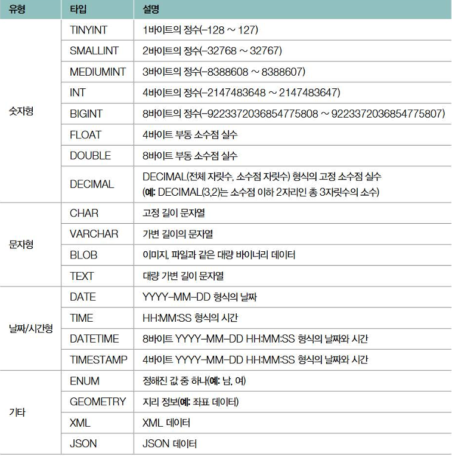
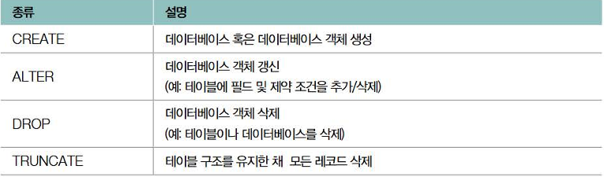
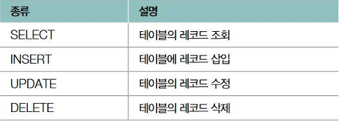
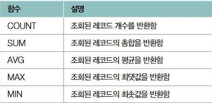
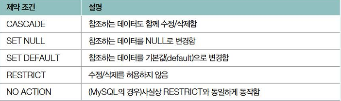
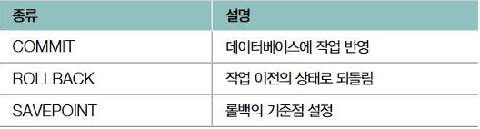
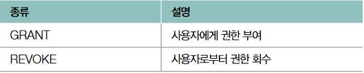
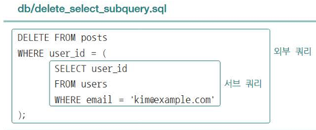
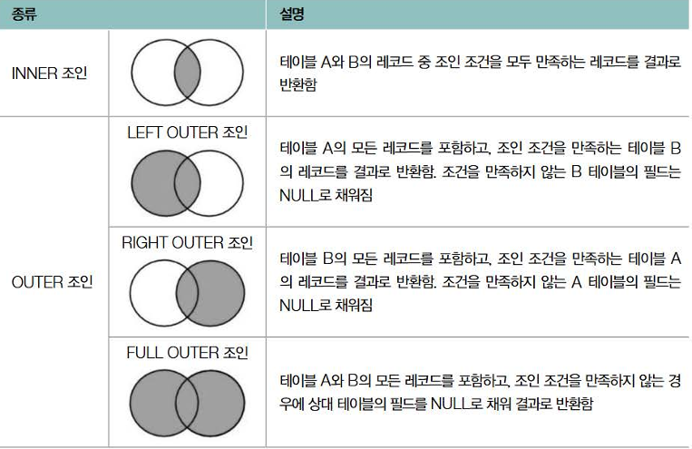
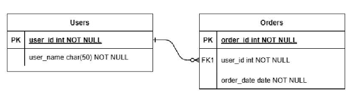

# 6장 데이터베이스

## 1. 데이터베이스의 큰 그림

#### 데이터베이스와 DBMS

- 데이터베이스 : 여러 사람이 공유하여 사용할 목적으로 체계화해 통합, 관리하는 데이터의 집합

  - 원하는 기능을 동작시키기 위해 마땅히 저장해야 하는 정보의 집합

  - 관리하기 위한 수단으로 '데이터베이스 관리 시스템(DBMS)' 사용

    - 관계형 데이터베이스 관리 시스템(RDBMS)
    - NoSQL 데이터베이스 관리 시스템(NoSQL DBMS)

  - 응용 프로그램들에게 DBMS는 마치 하나의 서버와 같다.
    - DBMS 클라이언트가 DBMS에 쿼리(query)를 보내고, 이를 바탕으로 데이터베이스를 다룬다. (대표적으로 SQL)
      - 데이터 정의를 위한 DDL
      - 데이터 조작을 위한 DML
      - 데이터 제어를 위한 DCL
      - 트랜잭션 제어를 위한 TCL

#### 파일 대신 데이터베이스를 이용하는 이유

1. 데이터 일관성 및 무결성 제공 어려움

   - 동시다발적으로 데이터를 이용할 경우 문제가 발생한다.(ex : 레이스 컨디션)

2. 불필요한 중복 저장이 많아짐

   - 큰 저장 공간 낭비로 이어질 수 있다.

3. 데이터 변경 시 연관 데이터 변경이 어렵다.

   - 모든 파일에서 하나 하나 바꿔야 한다.

4. 정교한 검색이 어렵다.

   - 파일이 많은 경우 문자열 검색에 국한될 수 있다.

5. 백업 및 복구가 어렵다.
   - 보통 단순 파일 입출력에서는 제공하지 않는다.

#### 데이터베이스의 저장 단위와 트랜잭션

- 데이터베이스의 저장 단위

  - 엔티티(entity)
    - 독립적으로 존재할 수 있는 객체
    - 데이터베이스에 저장될 경우 기록된 엔티티를 레코드(record)라고 부른다. (MongoDB에서는 도큐먼트(document)라고 부른다.)
  - 속성(attribute)
    - 엔티티의 특성
    - 같은 속성을 공유하는 개별 엔티티는 같은 `엔티티 집합`에 속한다.
    - 레코드의 속성을 필드(field)라고 한다.
      - 이 때 필드의 수를 차수(degree)라 부르고, 한 필드에 대한 고유 값의 수는 카디날리티(cardinality)라 한다.
  - 엔티티 집합
    - 릴레이션(relation)
      - RDBMS에서 부르는 엔티티 집합.
      - 보통 테이블(표)로 나타냄
    - 컬렉션(collection)
      - NoSQL(MongoDB)에서 부르는 엔티티 집합

- 스키마

  - 레코드가 지켜야 할 틀
  - RDBMS는 명확한 스키마(테이블)가 정의된다.
  - NoSQL은 명확한 스키마가 없어 '스키마-리스 데이터베이스'라고도 부른다.

- 트랜잭션과 ACID

  - 트랜잭션
    - 데이터베이스와의 논리적 상호작용의 단위
    - 동시다발적으로 데이터베이스를 사용할 때 트랜잭션 보장을 위한 원칙을 ACID라고 한다.
      1. 원자성(Atomicity)
         - 하나의 트랜잭션 결과가 모두 성공하거나(commit) 모두 실패하는(rollback) 성질
      2. 일관성(Consistency)
         - 트랜잭션 전후 데이터베이스가 일관된 상태를 유지하는 성질
      3. 격리성(Isolation)
         - 동시에 수행되는 여러 트랜잭션이 서로 간섭하지 않도록 보장하는 성질
      4. 지속성(Durability)
         - 트랜잭션이 성공적으로 완료된 후 그 결과가 영구적으로 반영되는 성질

## 2. RDBMS의 기본

#### 필드와 레코드

- 필드 타입
  - 각 필드로 사용 가능한 데이터 유형
    
- 키

  - 테이블 내의 특정 레코드를 식별할 수 있는 집합
  - 후보 키
    - 테이블의 한 레코드를 식별하기 위한 필드의 최소 집합
    - 유일성, 최소성을 모두 만족하는 키
  - 복합 키
    - 두 필드 이상으로 구성된 후보 키
  - 슈퍼 키
    - 레코드를 식별하기 위한 필드의 집합
    - 유일성은 만족하나 최소성은 만족하지 않는다.
  - 기본 키
    - 레코드를 식별하도록 선정되어 테이블당 하나만 존재할 수 있는 키
    - 유일성과 최소성을 만족하며 중복된 값이 없고, 값이 무조건 존재한다(Null이 없다).
  - 대체 키
    - 기본키가 아닌 후보 키
  - 외래 키
    - 다른 테이블의 기본 키를 참고하는 필드

#### 테이블의 관계

- 일대일 대응 관계

  - 한 테이블의 하나의 레코드가 다른 테이블의 레코드 하나에만 대응되는 경우

- 일대다 대응 관계

  - 한 테이블의 하나의 레코드가 다른 테이블의 여러 레코드와 대응될 수 있는 경우

- 다대다 대응관계
  - 한 테이블의 여러 레코드가 다른 테이블의 여러 레코드와 대응되는 경우
  - 일반적으로 중간 테이블을 수반한다.
    - 이 경우 일대다 대응이 두 번 이뤄진 것과 같다.

#### 무결성 제약 조건

- 데이터베이스의 저장된 데이터의 일관성과 유효성을 유지하기 위해 지켜야 하는 조건

1. 도메인 제약 조건(domain constraint)

   - 테이블이 가질 수 있는 필드 타입과 범위에 대한 규칙
   - 필드 데이터는 원자 값(더 이상 쪼갤 수 없는 단일한 값)을 가지고, 지정된 필드 타입과 조건을 지켜야한다.

2. 키 제약 조건(key constraint)

   - 레코드를 고유하게 식별할 수 있는 키로 지정된 필드에 중복된 값이 있으면 안된다.

3. 엔티티 무결성 제약 조건(entity integrity constraint)

   - 기본 키로 지정한 필드는 고유한 값이어야 하며 Null일 수 없다.
   - '기본 키 제약 조건' 이라고도 한다.

4. 참조 무결성 제약 조건(referential integrity constratint)

   - 외래 키는 참조하는 테이블의 기본 키와 같은 값을 갖거나 Bull 값을 가져야 한다.
     -'외래 키 제약 조건' 이라고도 한다.

## 3. SQL

#### 데이터 정의 언어(DDL)



- CREATE

  - 데이터베이스에서 관리될 수 있는 다양한 대상을 정의하는 명령어
  - 아래와 같은 형태로 테이블을 만들 수 있다.
    ```
    CREATE TABLE 테이블_이름 (
      필드_이름 필드_타입 제약조건,
    );
    ```

- ALTER

  - CREATE로 생성된 다양한 대상에 새롭게 추가하거나, 기존 필드, 제약 조건 등의 내용을 수정/삭제하는 명령어

- DROP

  - 만들어진 다양한 대상을 삭제하는 명령어.

- TRUNCATE
  - 테이블의 모든 행을 삭제하는 명령어.
  - 테이블의 구조는 유지한다.

#### 데이터 조작 언어(DML)



- SELECT

  - 삽입된 레코드를 조회하는 명령
  - 연산/집계 함수와 함께 사용되기도 한다.
    
  - 여러 조건을 나타내는 절과 함께 사용되기도 한다.
    - GROUP BY
      - 특정 필드를 기준으로 필드를 그룹화하기 위해 사용
      - 연산/집계 함수와 사용되는 경우가 많다.
    - HAVING
      - GROUP BY절로 그룹화된 결과에 조건을 적용하기 위해 사용
      - 그룹화된 레코드에 대한 조건식
    - ORDER BY
      - 특정 필드를 기준으로 데이터를 정렬하는 데 사용 (ASC, DESC)
    - LIMIT
      - 조회할 레코드 수를 제한하기 위해 사용
  - 여러 조건을 나타낼 때 다음과 같은 순서로 실행된다.
    - FROM -> WHERE -> GROUP BY -> HAVING -> SELCT -> ORDER BY -> LIMIT

- INSERT

  - 테이블에 레코드를 삽입하는 명령
  - 무결성 제약 조건을 지키지 않을 경우 INSERT문의 실행이 거부된다.

- UPDATE

  - 특정 레코드를 수정하는 명령
  - 보통 'WHERE 조건식' 과 같이 사용된다.
  - WHERE절이 없을 경우 테이블의 모든 레코드가 수정된다.

- DELETE

  - 특정 레코드를 삭제하는 명령
  - 보통 'WHERE 조건식' 과 같이 사용된다.
  - WHERE절이 없을 경우 테이블의 모든 레코드가 삭제된다.

- UPDATE, DELETE 시 외래 키 변화
  - 정의된 제약 조건에 따라 다르게 행동한다.
    

#### 트랜잭션 제어 언어(TCL)



- COMMIT
  - 트랜잭션이 성공적으로 완료되어 트랜잭션에서 수행된 모든 변경 사항을 데이터베이스에 영구 반영
  - DDL문은 자동을 커밋된다.(DB 수정 시 자동 커밋 확인)
- ROLLBACK
  - 트랜잭션에서 수행된 변경 사항을 취소하고, 데이터베이스를 트랜잭션 시작 이전으로 되돌림
- SACEPOINT
  - ROLLBACK으로 되돌아갈 시점을 지정

#### 데이터 제어 언어(DCL)



- GRANT
  - 사용자에게 권한을 부여
- REVOKE
  - 사용자에게 권한을 회수

## 4. 효율적 쿼리

#### 서브 쿼리와 조인

- 서브 쿼리
  - 다른 SQL문이 포함된 SQL문 (다른 SQL문 안에 있는 SELECT문)
  - 예시
    
- 조인
  - 2개의 테이블을 하라로 합치는 것
  - 크게 INNER 조인과 OUTER 조인이 있다.
    
    - INNER 조인
      - 가장 일반적인 조인
      - 조인 조건을 모두 만족하는 데이터만을 선택해 결합하는 일종의 교집합 연산
    - OUTER 조인
      - LEFT OUTER
        - 왼쪽 테이블의 레코드를 기준으로 오른쪽 테이블의 레코드를 합치는 조인
        - 오른쪽 테이블에 대응되는 레코드가 없을 시 Null로 간주
      - RIGHT OUTER
        - 오른쪽 테이블의 레코드를 기준으로 왼쪽 테이블의 레코드를 합치는 조인
        - 왼쪽 테이블에 대응되는 레코드가 없을 시 Null로 간주
      - FULL OUTER
        - 두 테이블의 모든 레코드를 선택하되, 대응되지 않는 모든 레코드를 Null로 표기하는 조인
        - 보통 RDBMS에서 지원하지 않아 `UNION`을 통해 LEFT, RIGHT의 결과를 결합한다.

#### 뷰

- 뷰
  - SELECT문의 결과로 만들어진 가상의 테이블
  - SELECT문의 결과를 뷰로 생성한 뒤, SQL문을 실행해 볼 수 있다.
  - 보통 쿼리의 단순화, 재사용성을 높이기 위해 많이 사용한다.
  - 특정 사용자에게 테이블의 특정 데이터만을 보여주고자 할 때도 사용할 수 있다.
  - SELECT에는 제한이 없지만, INSERT, UPDATE, DELETE가 불가능한 경우가 많다.

#### 인덱스

RDBMS 성능을 향상시키는 가장 대중적인 방식

- 인덱스
  - 검색 속도 향상을 목적으로 만드는 하나 이상의 테이블 필드에 대한 자료구조
  - 보통 B 트리(혹은 B+ 트리)를 사용한다.
  - 보통 테이블 당 3개 이하의 인덱스를 권고한다.
  - 인덱스는 조회 성능은 향상시킬 수 있지만 그 외의 삽입, 수정, 삭제 작업 시 성능 저하를 유발하기도 함을 유의하자
  - MySQL에서는 인덱스의 종류를 크게 클러스터형 인덱스와 세컨더리 인덱스로 구분한다.
    - 클러스터형 인덱스
      - 테이블당 하나씩 만들 수 있는 인덱스(기본 키)
    - 세컨더리 인덱스(논클러스터형 인덱스)
      - 테이블 당 여러 개가 존재할 수 있지만 클러스터형 인덱스보다 느리다.

## 5. 데이터베이스 설계

#### ER 다이어그램

- ERD
  - 엔티티 관계를 표현하는 다이어그램.
  - 데이터베이스 모델링하는 것을 목적으로 설계된다.
  - 피터 첸 표기법
    
    - 엔티티를 개념적으로 모델링하는 데 유용
    - 한 눈에 파악하기 어렵다.
  - IE 표기법(새 발 표기법, 까마귀 발 표기법)
    
    - 사각형 하나가 테이블 하나, 테이블 관계를 새 발과 같이 표기
    - 관계를 세부적으로 나타낼 수 있다.

#### 정규화

- 정규화
  - 잠재적인 문제가 발생하지 않도록 테이블의 필드를 구성하고, 테이블을 나누는 작업
  - 제1 정규형
    - 모든 속성이 원자 값을 가진다.
    - 필드 데이터가 더 이상 쪼개질 수 없는 값을 가진다.
  - 제2 정규형
    - 제1 정규형을 만족하며, 기본 키가 아닌 모든 필드들이 모든 기본 키에 완전히 종속된다.
    - 기본 키 일부에만 종속되는 필드가 있다면(부분 함수 종속성), 분리할 필요가 있다.
    - 기본 키 전체에 완전하게 종속되어 있는 상태(완전 함수 종속성)
    - 부분 함수 종속성이 없는, 완전 함수 종속인 상태
  - 제3 정규형
    - 제2 정규형을 만족하며, 기본 키가 아닌 모든 필드가 기본 키에 이행적 종속성이 없는 상태
      - 이행적 종속성 : A(기본키) -> B, A-> C 외에 B -> C 와 같은 종속성.
    - 기본 키가 아닌 나머지 필드들이 간접적으로라도 종속되지 않아야 한다.
  - 보이스/코드 정규형
    - 제3 정규형을 만족하며 모든 결정자가 후보 키인 상태
      - 결정자 : 특정 필드를 식별할 수 있는 필드
  - 역정규화
    - 과도한 정규화로 테이블이 너무 쪼개질 경우 조인 연산으로 인해 성능 비용이 늘어난다.
    - 이를 막기 위해 하나의 테이블로 데이터를 관리하기도 한다.

## 6. NoSQL

#### RDBMS vs NosQL

- NoSQL은 높은 부하를 감당하거나 대용량 데이터를 다루는 분산 환경에서 빛을 발한다.
- ACID와 정규화를 엄격하게 준수하지는 않지만, 이를 통해 큰 성능 향상을 얻기도 한다.

- NoSQL 데이터베이스 유형

  - 키-값 데이터베이스
    - Redis, Memcached 등이 대표적
    - 보통 보조기억장치가 아닌 메모리에 저장되는 '인-메모리 데이터베이스'로 활용한다.
    - 캐시, 세션 등 가벼운 정보를 저장하는 경우가 많다.
  - 도큐먼트 데이터베이스
    - MongoDB가 대표적
    - 도큐먼트 단위로 레코드를 관리하는 데이터베이스
    - 고정된 스키마가 없어 유연한 스키마를 가질 수 있는 장점이 있다.
  - 그래프 데이터베이스
    - 그래프의 노드 형태로 데이터를 저장하는 데이터베이스
    - neo4j가 대표적
    - SNS 친구 관계, 교통망과 같이 데이터 간의 관계성이 중요한 레코드를 저장하기 위해 주로 사용
  - 칼럼 패밀리 데이터베이스
    - Cassandra, HBase
    - RDBMS와 유사하게 행, 열의 개념과 '로우 키'를 통해 특정 행을 식별
    - 정규화나 조인을 사용하지 않기에 스키마가 고정되어 있지 않음
    - 관련 있는 열들이 모여 '칼럼 패밀리'를 형성하고, 이는 '키스페이스'라는 단위를 형성한다.
